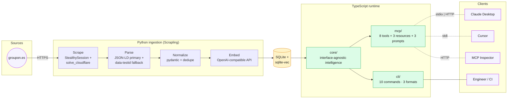
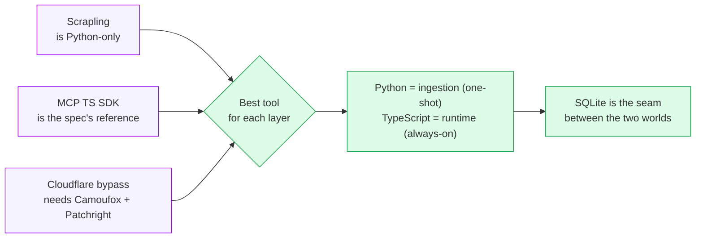
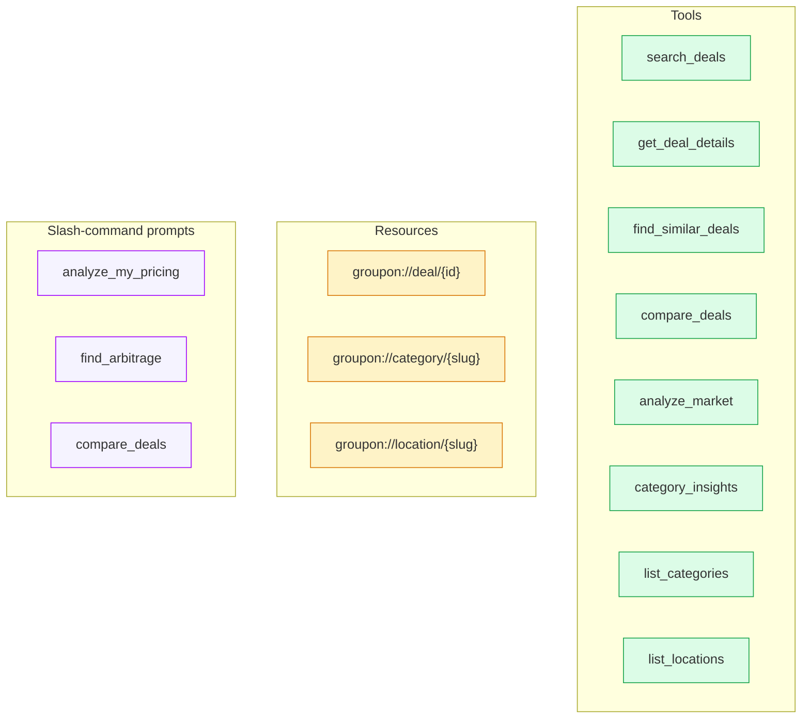
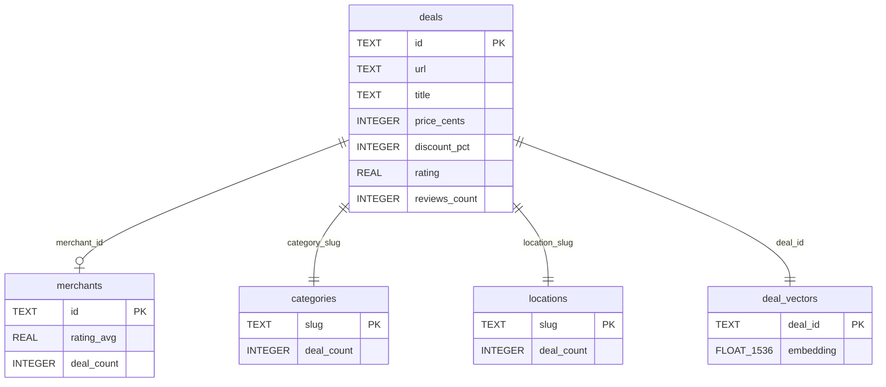

<div align="center">


# Groupon Deal Intelligence MCP

**An MCP server (and companion CLI) that turns groupon.es into a queryable, semantically-searchable, merchant-analytics-ready data layer for any AI agent.**

[](.nvmrc)
[](tsconfig.json)
[](ingestion/pyproject.toml)
[](https://github.com/modelcontextprotocol/typescript-sdk)
[](LICENSE)

</div>

> Submitted as the Foundry Challenge for the **AI Fullstack Engineer — Nodegraph** role at Groupon. The brief asked for an MCP server that any MCP client can connect to and use to answer questions about groupon.es deals — built to demonstrate engineering taste, AI tooling fluency and product thinking in a deliberately under-specified problem.

---

## TL;DR

```bash
git clone https://github.com/diegoperezg7/groupon-deal-intelligence-mcp
cd groupon-deal-intelligence-mcp

# 1. Install (Node + Python)
npm install
cd ingestion && uv venv && uv pip install -e . && cd ..

# 2. Configure (one key for embeddings via OpenRouter or OpenAI)
cp .env.example .env && $EDITOR .env

# 3. Run the ingest pipeline (or use the committed sample)
groupon-intel ingest    # or: python -m groupon_ingest ingest

# 4. Connect from any MCP client (see Quick start below)
npm run build
groupon-intel doctor    # end-to-end health check
```

---

## What this does

You point an MCP-compatible client at this server (Claude Desktop, Claude Code, Cursor, the MCP Inspector, anything) and it can now answer questions like:

- *"Find me the best wellness deals in Madrid under €50."*
- *"What's the median price for beauty offers in Barcelona right now? Show me the top 5 by attractiveness."*
- *"I run a spa in Madrid charging €60. How does my pricing compare to the segment?"*
- *"Which Spanish cities have the most underserved beauty market relative to wellness?"*
- *"Compare these three deals for an anniversary dinner — which one wins?"*

…all in **structured tool output** the LLM can reason over directly, not blobs of HTML it has to parse.

---

## Why MCP **and** CLI?

> _The main deliverable is the MCP server, since the challenge asks for an interface any MCP client can connect to. I also expose the same intelligence layer through a thin CLI._

There are three reasons that decision is worth more than a tool count:

| Reason                  | What it means in practice                                                                                                                                                                                  |
|-------------------------|------------------------------------------------------------------------------------------------------------------------------------------------------------------------------------------------------------|
| **Token cost asymmetry**| MCP servers load their tool schema into every conversation — typically 5–15K tokens *before* the user's first message. For high-frequency or batch use, a CLI is dramatically cheaper.                  |
| **Debugging + CI**      | A CLI is trivial to script, pipe, and assert on. An MCP over stdio is awkward to test in a CI pipeline; the CLI isn't.                                                                                       |
| **Platform thinking**   | In a Nodegraph-style internal AI platform, the same capability should be reachable from agents (MCP), engineers (CLI), and services (HTTP). The interface depends on the consumer; the intelligence layer should be reusable. |

Both interfaces share **the same `core/` engine**. Adding a future HTTP wrapper is a thin file on top of the same code.

---

## Architecture



**The golden rule**: `core/` imports nothing from `mcp/` or `cli/` — only the reverse. That separation is what lets us add a third interface (HTTP, gRPC, anything) without disturbing the intelligence.

### Why a hybrid Python + TypeScript stack?



---

## Quick start

### Prerequisites

- **Node** ≥ 22 (see `.nvmrc`)
- **Python** ≥ 3.10 (`uv` recommended, plain `pip` works too)
- One of:
  - An **OpenAI API key** (or any [OpenAI-compatible endpoint](#using-openrouter-or-another-openai-compatible-provider) like OpenRouter)
  - **Ollama** running locally with `nomic-embed-text` pulled

### 1. Install

```bash
git clone https://github.com/diegoperezg7/groupon-deal-intelligence-mcp
cd groupon-deal-intelligence-mcp

# TypeScript side
npm install
npm run build

# Python side
cd ingestion
uv venv && source .venv/bin/activate
uv pip install -e .
python -m camoufox fetch          # one-time: downloads the stealth browser
cd ..
```

### 2. Configure

```bash
cp .env.example .env
# edit .env to set OPENAI_API_KEY (or switch EMBEDDINGS_PROVIDER=ollama)
```

### 3. Populate the catalogue

Two options:

```bash
# Option A: use the committed sample (52 real deals scraped on 2026-05-15)
python -m groupon_ingest embed data/sample-deals.json --sqlite data/deals.sqlite

# Option B: run a fresh scrape (~10 min for ~50 deals, longer for more)
groupon-intel ingest --max 12
```

### 4. Verify the install

```bash
groupon-intel doctor
```

Expected output:

```
groupon-intel doctor
  ✓ config loaded (provider=openai)
  ✓ SQLite at /.../data/deals.sqlite
  ✓ schema version 1
  ✓ 52 deals in catalogue
  ✓ 8 categories
  ✓ 7 locations
  ✓ embeddings provider responded (dim=1536)
  ✓ semantic search works — top hit: 'Masaje relajante…' (sim=0.553)

All green. The MCP server is ready to serve.
```

### 5. Connect Claude Desktop

Copy the snippet from [`scripts/claude-desktop-config.json`](scripts/claude-desktop-config.json) into your Claude Desktop config (substituting absolute paths), then restart Claude Desktop. The server appears as **groupon-es-deal-intelligence** with 8 tools, 3 resources and 3 slash-command prompts.

---

## MCP surface



### Tools

| Tool                  | Purpose                                                                                                          | Annotations                                |
|-----------------------|------------------------------------------------------------------------------------------------------------------|--------------------------------------------|
| `search_deals`        | Semantic + filtered search (query, location, category, max price, min rating).                                   | readOnly, idempotent                       |
| `get_deal_details`    | Full normalised record for a deal by id or URL, plus its merchant.                                                | readOnly, idempotent                       |
| `find_similar_deals`  | Embedding-based KNN over a reference deal's own vector (no re-embedding round-trip).                              | readOnly, idempotent                       |
| `compare_deals`       | Score and rank 2–10 deals side-by-side with a deterministic attractiveness score (discount, rating, popularity, price). | readOnly, idempotent                       |
| `analyze_market`      | Merchant-side intel for a (category, location) pair: price stats, discount distribution, top performers, underserved nearby locations, copy patterns. | readOnly, idempotent                       |
| `category_insights`   | Cross-location breakdown for one category.                                                                       | readOnly, idempotent                       |
| `list_categories`     | Discovery: every category + deal count.                                                                          | readOnly                                   |
| `list_locations`      | Discovery: every location + deal count.                                                                          | readOnly                                   |

Every tool declares **both** a Zod input schema and output schema, and returns `structuredContent` so MCP-aware clients render typed data (not stringified JSON).

### Resources

URI template resources let an MCP client list and read entities directly, no tool call required.

- `groupon://deal/{id}` — the canonical view of one deal.
- `groupon://category/{slug}` — the 20 most attractive deals in a category.
- `groupon://location/{slug}` — the 20 most attractive deals in a city.

### Prompts

Prompts surface as **slash-commands** in compatible clients (e.g. `/analyze_my_pricing` in Claude Desktop). They pre-bind arguments and write a tight opening user message so the agent goes straight to invoking the right tools.

- `analyze_my_pricing` — merchant: "I sell X in Y at price Z, where do I fit?"
- `find_arbitrage` — analyst: surface high-quality deals in thin segments.
- `compare_deals` — shopper: rank a hand-picked set with reasoning.

---

## CLI surface

```bash
$ groupon-intel --help

groupon-intel  CLI companion to the groupon-deal-intelligence MCP server.

Commands:
  search [query...]      semantic search
  deal <id-or-url>       show one deal
  similar <id-or-url>    KNN over a reference deal's embedding
  compare <ids...>       rank 2–10 deals
  analyze                merchant-side analytics (-c category -l location)
  category <slug>        cross-location insights for a category
  categories             list every category in the catalogue
  locations              list every location in the catalogue
  ingest                 run the Python pipeline end-to-end
  doctor                 health check (config, store, embeddings, search)
```

Switch output with `-f json|table|markdown`. Defaults to **table** on a TTY, **json** when piped — so it works equally well at a terminal and in CI.

### Demo

```bash
$ groupon-intel search "masaje relajante para parejas" --limit 3
┌──────────────────────────────────┬────────────────────────────────────────────────────┬──────────┬─────────┬───┬───┬───┬───────┐
│ ID                               │ Title                                              │ City     │ Cat     │ € │ % │ ★ │   sim │
├──────────────────────────────────┼────────────────────────────────────────────────────┼──────────┼─────────┼───┼───┼───┼───────┤
│ masajes-bermejales-2             │ Masaje en pareja de 45 o 90 minutos o ritual Rela… │ sevilla  │ belleza │ — │ — │ — │ 0.555 │
│ sense-natur-massage-masaje-en-p… │ Masaje en pareja de hasta 90 minutos con bebida y… │ valencia │ belleza │ — │ — │ — │ 0.541 │
│ dm-by-bodywood-7                 │ Masaje a elegir entre relajante, descontracturant… │ malaga   │ belleza │ — │ — │ — │ 0.534 │
└──────────────────────────────────┴────────────────────────────────────────────────────┴──────────┴─────────┴───┴───┴───┴───────┘
```

---

## Data layer

A single `data/deals.sqlite` file with [sqlite-vec](https://github.com/asg017/sqlite-vec) for KNN. Zero external infrastructure.



The 1536-dimensional vector slot fits OpenAI `text-embedding-3-small` natively and right-pads smaller models (Ollama `nomic-embed-text` is 768d). Trade-off: ~3 MB of zero-padding per 500 deals in exchange for **provider portability without a migration**.

---

## Engineering decisions

### Reading data, not chasing class names

The deal-page parser tries Schema.org JSON-LD **first** (every Groupon deal page ships a `ProductGroup`, a `BreadcrumbList` and an `AggregateRating`), `data-testid` attributes second, OpenGraph third, and DOM heuristics last. That makes the pipeline robust to A/B-test layouts — JSON-LD is a contract Groupon needs to keep for Google.

### Anti-stdout discipline

MCP stdio dies the moment any non-JSON-RPC byte hits stdout. We enforce this two ways:

1. **`pino` is configured with `pino.destination(2)`** — every log line goes to stderr.
2. **ESLint has a `no-console: error` rule scoped to `src/mcp/**`** — even an accidental `console.log` fails the build.

### Deterministic-then-LLM, not LLM-everywhere

`compare_deals` and `analyze_market` use **deterministic scoring + analytics** before any LLM call. The LLM downstream gets the numbers and ranks the explanation — it doesn't have to invent the math. This is the same Chain-of-Thought hygiene that keeps an agent from hallucinating prices.

### Provider abstraction over OpenAI-compatible

`OpenAIEmbeddingsProvider` accepts an `OPENAI_BASE_URL`, so the **same code path** works against:

- OpenAI directly
- OpenRouter (one key, many providers — the project's default)
- Azure OpenAI deployments
- Any future drop-in gateway

Switch with one env var.

---

## How AI was used in this project

> _The brief says "How you use AI is part of what we're evaluating, not a side note." — so here's the honest answer._

**Claude Code** was my pair throughout. I drove design, decisions and review; Claude drafted and modified code under my direction. Concretely:

- **Architecture and stack choices** are mine. The hybrid Python + TS split, the pre-ingestion-not-request-time-scraping decision, the shared-`core/`-two-interfaces principle, the "Schema.org JSON-LD first" parser strategy, the provider abstraction over `OPENAI_BASE_URL` — those came out of conversations and explicit calls.
- **Boilerplate-y code generation** (Zod schemas mirroring SQL columns, command files mirroring tool files, type annotations for `ScrapedDeal` / `NormalizedDeal`, the table renderer) was largely Claude-drafted and code-reviewed by me. Every file got a read-through before commit.
- **Iteration over reality**: when the first scrape returned 404s because I'd guessed the URL pattern wrong, I wrote a discovery script first (the kind of thing a senior engineer reaches for), inspected the actual JSON-LD, and rewrote the parser. That round-trip wouldn't have been any faster without AI — the bottleneck was the real-world ground truth.
- **Test design** was mine; test code was largely Claude-drafted under tight guidance. The `InMemoryTransport` pattern came from reading the official MCP SDK source.

There are no hidden prompts, no `# generated by` headers stripped. The repo history is what actually happened.

---

## Trade-offs

See [`docs/trade-offs.md`](docs/trade-offs.md) for the long version. The short list:

- **52 deals**, not 500. With more time I'd implement scroll-triggered pagination on listings; for a take-home demo, depth beat breadth.
- **One-shot ingestion**, not scheduled. The pipeline is a script, not a service. Production would wrap it in a cron + diff-only re-embedding.
- **Stdio + Streamable HTTP stub** — stdio is fully wired; HTTP is one server call short of working. The seam exists, the wire is unhooked.
- **Adaptive selectors disabled** — Scrapling's auto-relocation is intriguing but undocumented. A one-shot pipeline doesn't need it.
- **English-only system prompts in `instructions`** — the user-visible content stays Spanish (the source of truth), but I write for the LLM in English to keep the agent's reasoning sharper.

---

## Next steps

See [`docs/next-steps.md`](docs/next-steps.md). Headlines:

- Real-time deal monitoring with a scheduled re-ingest + change-only embeddings.
- Multi-locale (`groupon.com`, `.de`, `.fr`) using the same JSON-LD parser.
- A third interface: HTTP API mirroring the CLI/MCP surface for internal service consumers.
- LLM-based deal-copy improvement suggestions (a `suggest_better_title` tool) using the same provider abstraction.
- Merchant-facing dashboard on top of `analyze_market`.

---

## Repo layout

```
groupon-deal-intelligence-mcp/
├── ingestion/                 Python — Scrapling pipeline + scripts
│   └── src/groupon_ingest/    scraper, parsers, normalizer, embedder, cli
├── src/
│   ├── core/                  intelligence layer (search, scoring, market, store)
│   ├── mcp/                   MCP server: 8 tools, 3 resources, 3 prompts
│   ├── cli/                   commander-based CLI: 10 commands, 3 formats
│   └── shared/                pino → stderr, zod config, McpError helpers
├── data/
│   ├── sample-deals.json      52 real deals, committed for reviewers
│   └── deals.sqlite           gitignored — regenerated by ingest
├── docs/                      architecture, ai-usage, trade-offs, next-steps
├── tests/                     vitest: 22 assertions across core + MCP
├── .github/workflows/         CI: typecheck + lint + build + test
├── Dockerfile.mcp             Node 22 runtime image
├── Dockerfile.ingest          Scrapling-based ingest image
└── docker-compose.yml         two-step pipeline
```

---

## Time spent

**~5 hours focused work** on 2026-05-15. The repo history reflects the real flow — first commit at 11:05 local, last by ~16:00, with one round-trip to inspect real groupon.es HTML when my first URL pattern returned 404s.

---

## License

MIT — see [`LICENSE`](LICENSE).
