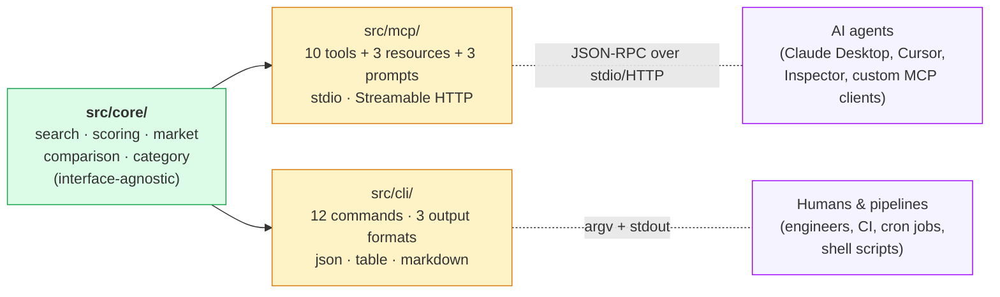
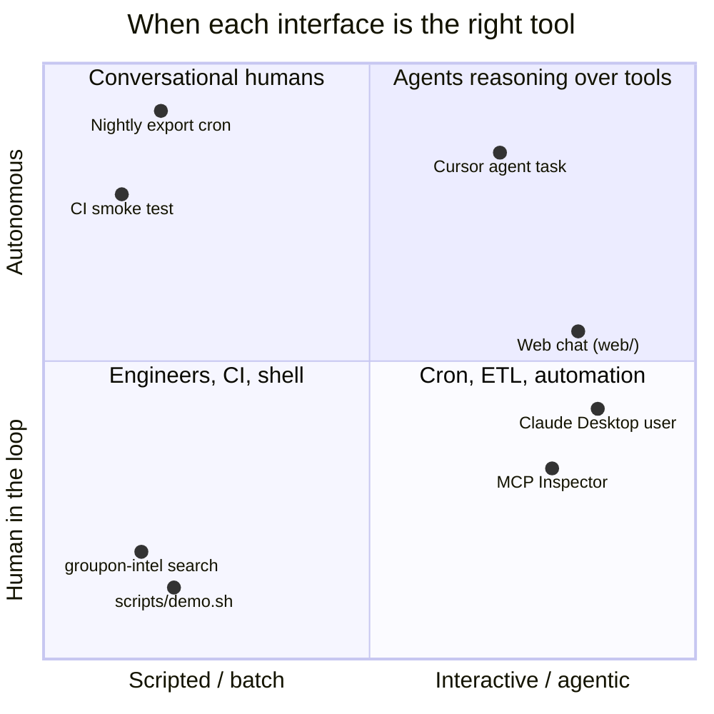
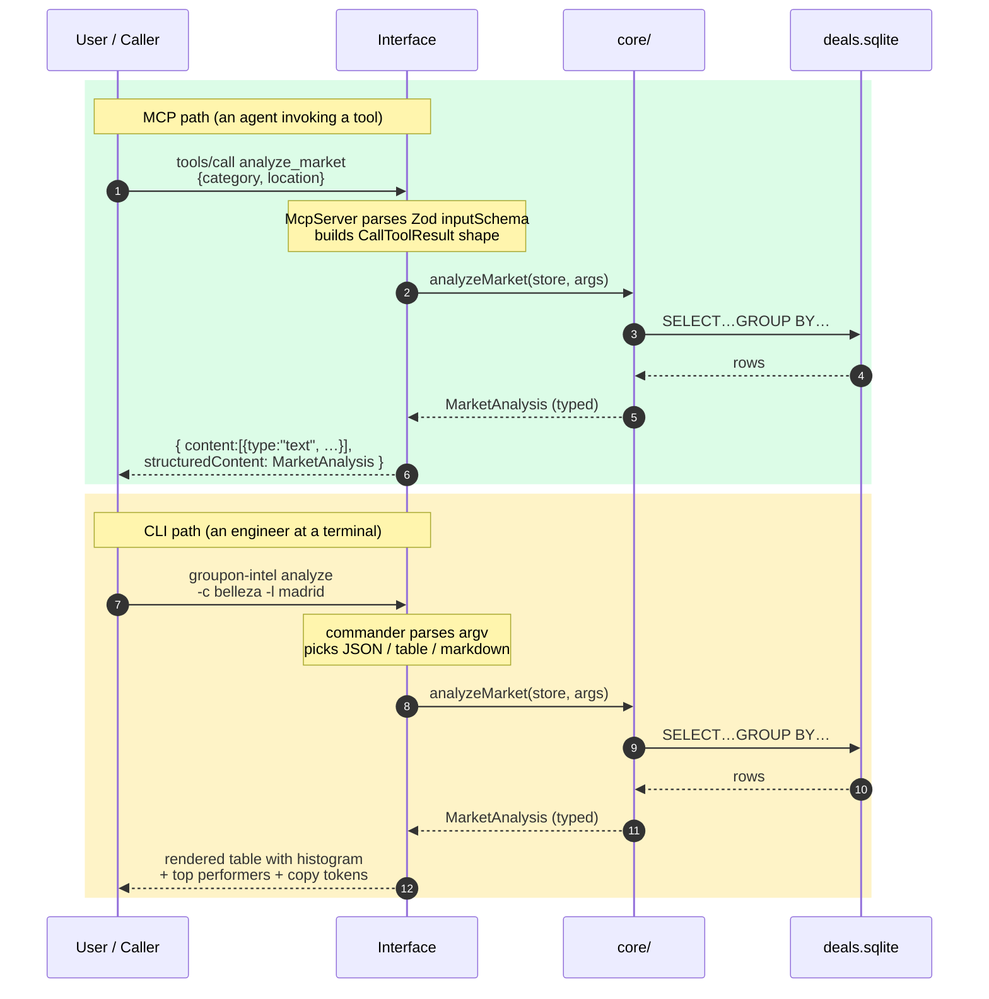
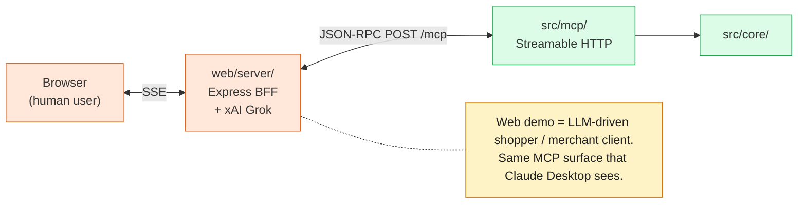

# MCP vs CLI — why this repo ships both

> The brief asked for an MCP server. We also ship a CLI. This doc explains why that wasn't a vanity decision and when each interface is the right tool.

## The one-line answer

The intelligence lives in `src/core/`. **MCP and CLI are two different ways to drive the same code** — they exist because the audience for each one is different, the cost model is different, and the operational story is different.

The rule that keeps this honest: **`core/` imports nothing from `mcp/` or `cli/`. Only the reverse.** Drop either interface tomorrow, the engine doesn't notice.

## When MCP wins, when CLI wins

## The mechanics of one call, side by side

**Steps 3–5 are byte-for-byte identical.** What changes is the wrapping at step 1/2 (parse argv vs parse JSON-RPC) and step 6 (render text vs return structured JSON).

## Side-by-side comparison

|  | MCP server | CLI `groupon-intel` |
|---|---|---|
| **Audience** | AI agents (Claude Desktop, Cursor, Inspector, custom clients) | Humans, CI runners, shell scripts, cron |
| **Transport** | stdio (default) or Streamable HTTP (port 3333) | argv + stdout/stderr |
| **Protocol** | JSON-RPC 2.0 wrapped in MCP (2025-03-26 spec) | POSIX command line |
| **Input** | Zod schemas → typed tool calls | Commander flags + positional args |
| **Output** | `structuredContent` with full type info + `content[]` text mirror | `--format json` (pipes) / `table` (TTY, UTF-8 boxes) / `markdown` |
| **Discovery** | `tools/list`, `resources/templates/list`, `prompts/list` | `groupon-intel --help`, `groupon-intel <cmd> --help` |
| **Cost per call** | Tool schema (~5–15K tokens) is loaded into every LLM conversation, plus each tool call counts tokens both ways | Zero LLM tokens. SQLite query is ~milliseconds. |
| **Failure mode** | LLM might hallucinate inputs / misinterpret output → tool throws `McpError` with actionable message | Bad argv → commander prints help + exit non-zero |
| **Composition** | Agent chains tools across multiple turns (`compare` → `analyze` → `search`) | Unix pipes — `groupon-intel search "spa" -f json \| jq …` |
| **Auth & multitenancy** | Per-MCP-client (Claude account, Inspector session, …) | Whatever filesystem permissions the SQLite file has |
| **Best for** | Open-ended user questions in natural language; complex multi-step reasoning; embedded in chat experiences | Repeatable scripts, debugging, CI smoke tests, batch export, ad-hoc queries by engineers |
| **Worst for** | High-frequency batch calls (every call drags 5–15K tokens of schema overhead) | Anything that needs natural-language understanding |
| **Verifiability** | `vitest` with `InMemoryTransport` — call tools as a client, assert `structuredContent` | `execa` smoke tests + the `doctor` command |

## Concrete moments where each one is the right answer

### CLI wins

- **CI smoke test on every push**: `groupon-intel doctor` reports green or fails the build. An MCP call would require spinning up a client and burning an LLM call.
- **`bash scripts/demo.sh` for a reviewer**: 30 seconds, no LLM, runs locally with zero credentials.
- **A merchant's analytics email**: cron at 06:00 → `groupon-intel analyze -c wellness -l madrid -f markdown > daily.md` → SMTP → done. No agent needed.
- **Debugging the data layer**: `groupon-intel deal <id>` returns the full JSON in a single command; no need to fire up Claude Desktop just to inspect one row.
- **Token-budget paranoid environments**: the CLI is the right interface when you want to consume the intelligence layer from an LLM-shy backend.

### MCP server wins

- **"I run a spa in Madrid charging 60€. Where do I sit?"** — Free-form natural language. The LLM picks `analyze_market`, fills `category="bienestar"`, `location="madrid"` from context, narrates the answer. No CLI flag matches that user's mental model.
- **Multi-step agent tasks** — "find me the top 3 wellness deals in Madrid under 50€, then compare them, then recommend the best for an anniversary". MCP-native: `search_deals` → `compare_deals` → reasoning.
- **Embedded in product** — Slack bot, Linear assistant, internal Nodegraph workflow, the kind of stuff Groupon's Nodegraph team builds. CLI doesn't compose into a conversational UI.
- **Discoverable contracts** — an agent can call `list_categories` to learn the vocabulary before forming a query. A CLI user reads the help text.

## The hidden third interface

The web chat in [`web/`](../web) is **not a third intelligence engine** — it's a frontend that talks to the MCP server over Streamable HTTP via raw JSON-RPC. The BFF doesn't import `core/` directly. That round-trip is the proof that "core + N interfaces" is real.

The web demo is the **best end-to-end illustration of the MCP contract**: an actual LLM (Grok) makes structured tool calls against an actual MCP server, the agent loop happens in a real BFF, the user sees the result streamed token by token. If the only thing that worked was the CLI, the project would still be useful — but it would be harder to argue that the MCP surface is the contract. The web demo closes that gap.

## What we explicitly did NOT do

Two anti-patterns worth flagging — both are common in projects that ship "an MCP server + a CLI":

1. **Duplicating logic between MCP and CLI**. We don't. Both call into `src/core/` and only differ in how they parse input and render output. If the MCP server's `search_deals` is buggy, `groupon-intel search` is buggy the exact same way, because they are the same code path past the first 10 lines.
2. **CLI calling the MCP server**. It would be convenient — "the CLI is just an MCP client", a popular pattern. But it adds an LLM round-trip the CLI doesn't need, and it couples the CLI's reliability to the MCP server being up. The CLI talks to `core/` directly; the MCP server talks to `core/` directly. **Two consumers, one engine.**

## Test parity

The same regression suite covers both surfaces:

| Layer | Test file | Assertions | What it proves |
|---|---|---|---|
| Core arithmetic | `tests/core/scoring.test.ts` | 12 | Both interfaces give the same score for the same deal |
| Core analytics | `tests/core/market.test.ts` | 5 | Both interfaces report the same price stats, copy patterns, gaps |
| MCP protocol | `tests/mcp/server.test.ts` | 19 | All 10 tools + 3 resources + 3 prompts respond correctly over `InMemoryTransport` |
| Web BFF | `web/tests/server/tools-mapping.test.ts` | 6 | MCP `inputSchema` → OpenAI function spec conversion is correct |
| SSE transport | `web/tests/frontend/parseSSE.test.ts` | 7 | Frontend reads the BFF event stream losslessly |
| Frontend store | `web/tests/frontend/store.test.ts` | 5 | Zustand store accumulates text + tool calls in the right order |

**60 assertions total. CLI behaviour is asserted indirectly via the `core/` tests — the wrappers are 50 lines per command, mostly argument parsing.**

## TL;DR for a reviewer

- **MCP server** = the deliverable. The brief asked for this.
- **CLI** = same intelligence, different audience. Cheaper, scriptable, demonstrable in 30 seconds with no LLM credentials.
- **Web demo** = the MCP server in actual use, end-to-end, with a real LLM. The receipt that the MCP contract works.

Three interfaces, one engine. That's the entire architectural claim of the project, in one sentence.
